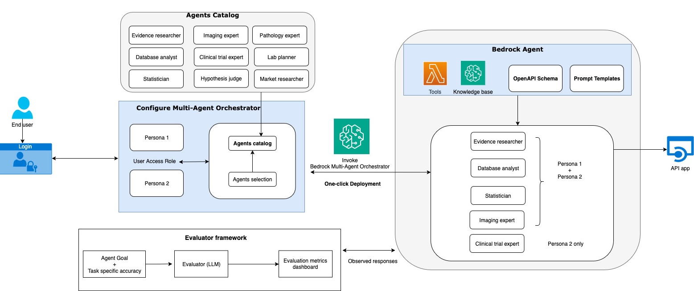

Agent orchestrators that can supervise and manage multiple sub-agents to address user requests.

## Available Orchestrators

- **[Biomarker scientific  advisor]** Supervisor that collaborates with multiple specialized AI agents  to identify and validate potential cancer biomarkers through intelligent analysis of scientific literature and biological data.

- **[Custom orchestrator]** Build your own orchestrator with Amazon Bedrock Agents or Bedrock Flows to handle multi-turn conversations across agents

