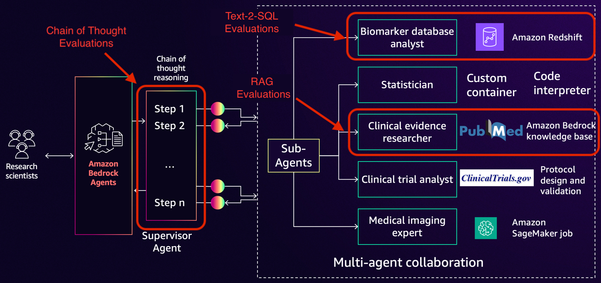
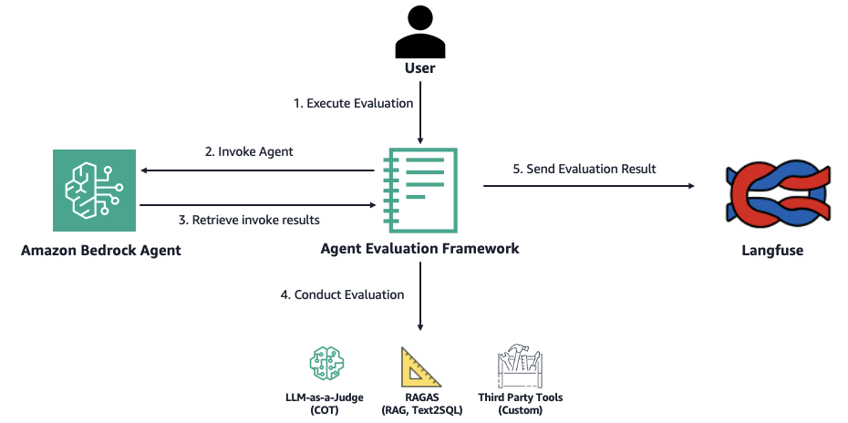

# Biomarker Multi-Agent Evaluation

This folder provides resources needed to evaluate the Biomarker Supervisor Agent against the [Bedrock Agent Evaluation Framework](https://github.com/aws-samples/amazon-bedrock-agent-evaluation-framework/tree/main).

The framework has the following features: 
* Evaluate Bedrock Agent on its capabilities (RAG, Text-to-SQL, Custom tool use) and overall Chain-of-Thought
* Comprehensive evaluation results and trace data sent to Langfuse with built-in visual dashboards
* Supports trace parsing and evaluations for various Bedrock Agent configuration options

It addresses the following technical challenges:
* Unavailability of End-to-End Agent Evaluation
* Challenging Experiment Management
* Lack of Agent Observability

The pharmaceutical research agent was built using the multi-agent collaboration feature of Bedrock. The figure above shows the multi-agent setup that was evaluated using this framework. As shown in the diagram, the RAG evaluations will be conducted on the ‘Clinical evidence researcher’ sub-agent. Similarly, Text-to-SQL evaluations will be run on the ‘Biomarker database analyst’ sub-agent. The Chain- of-Thought evaluation evaluates the final answer of the ‘Supervisor Agent’ to check if it properly orchestrated the sub-agents and answered the user’s question. 

We used a set of industry relevant pre-generated test questions for this pharmaceutical research agent setup. By creating groups of questions based on their topic regardless of the sub-agents that may be invoked to answer the question, we created trajectories that include multiple questions spanning multiple types of tool use. These trajectories can be viewed in [HCLS Trajectories](hcls_trajectories.json).

# Pre-requisites

1. Deploy the Biomarker Supervisor Agent in your AWS account by going to the multi_agent_orchestration/ folder of this repository and following instructions there

# Evaluation Steps

1. Navigate to the 'evaluate_biomarker_agent.ipynb' notebook and follow the steps there

2. Take a look at the diagram below to get a high level overview of the evaluation framework workflow:

